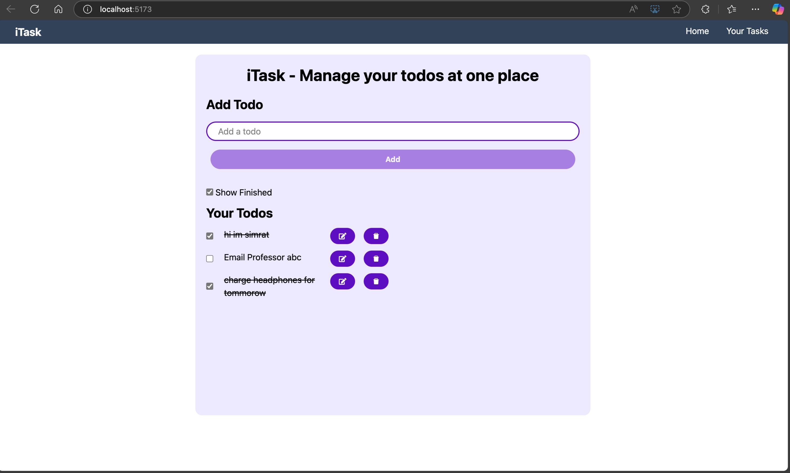

# iTask – Todo List App

**A responsive React.js application to manage your daily tasks in one place.**

---

## Table of Contents
- [Demo](#demo)
- [Features](#features)
- [Getting Started](#getting-started)
  - [Prerequisites](#prerequisites)
  - [Installation](#installation)
  - [Running Locally](#running-locally)
- [Usage](#usage)
- [Project Structure](#project-structure)
- [Built With](#built-with)
- [What I Learned](#what-i-learned)
- [Contributing](#contributing)
- [License](#license)

---

## Demo
  
*A sample view of the iTask interface on desktop and mobile.*

---

## Features
- **Add Todos Instantly**  
  Plan your day without missing a beat—enter a task and hit Add.  
- **Edit & Update Tasks**  
  Click the edit icon to correct or update a task in place.  
- **Mark Complete / Incomplete**  
  Toggle checkboxes to track your progress and stay motivated.  
- **Show/Hide Completed**  
  Focus mode: filter out finished tasks to concentrate on what’s left.  
- **Delete with Style**  
  Remove tasks easily with the delete button.  
- **Persistent Storage**  
  All tasks are saved in `localStorage` and survive page refreshes and browser restarts.  
- **Responsive UI**  
  Built with Tailwind CSS to look great on all devices.  

---

## Getting Started

### Prerequisites
- [Node.js](https://nodejs.org/) (v14 or later)
- [npm](https://www.npmjs.com
